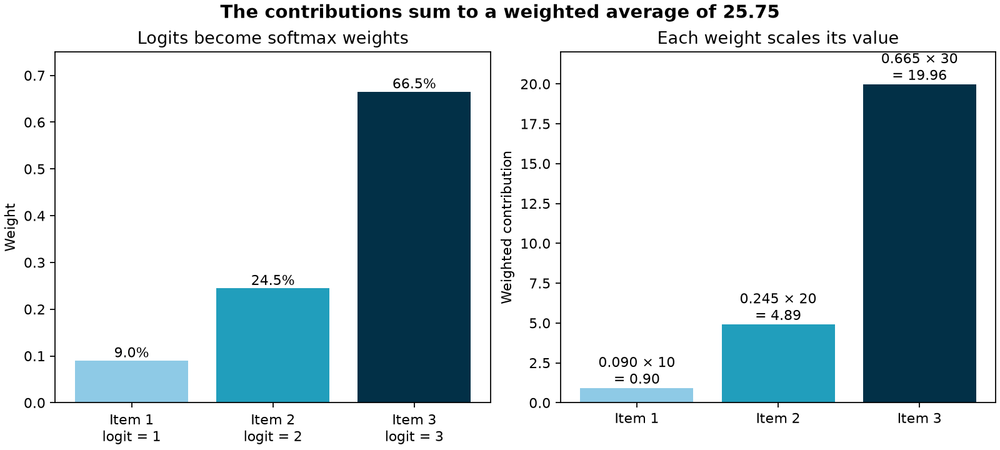

# Softmax and weighted averages

[**Explore the interactive visual demo →**](https://isaiahcampusano.github.io/softmax/)

Softmax turns a vector of raw scores, or **logits**, into non-negative weights
that sum to one. It also exaggerates differences: a slightly larger logit gets
a disproportionately larger weight.

For logits \(z_1, \ldots, z_n\), softmax is

$$
\operatorname{softmax}(z_i) =
\frac{e^{z_i}}{\sum_{j=1}^{n} e^{z_j}}.
$$

The implementation in this repository subtracts the largest logit before
exponentiating:

$$
\operatorname{softmax}(z_i) =
\frac{e^{z_i - \max(z)}}{\sum_{j=1}^{n} e^{z_j - \max(z)}}.
$$

This produces the same result while avoiding overflow for large inputs.

## From scores to a weighted average

Softmax itself does not average values. It creates the weights used by a
weighted average:

1. Start with values \([10, 20, 30]\).
2. Assign them logits \([1, 2, 3]\).
3. Apply softmax to get weights \([0.0900, 0.2447, 0.6652]\).
4. Combine the values with \(\sum_i w_i v_i\).

The result is approximately **25.75**. The largest value pulls the result
toward 30 because its logit receives about 66.5% of the total weight.

This score → softmax → weighted-sum pattern is also central to attention in
transformer models, where attention scores determine how strongly value
vectors are blended.



## Try it

Requires Python 3.10 or later.

```bash
python -m pip install -r requirements.txt
python example.py
```

Expected output:

```text
Values:                [10. 20. 30.]
Logits:                [1. 2. 3.]
Weights:               [0.09   0.2447 0.6652]
Sum of weights:        1.0000
Weighted average:      25.75
Plot saved to:         assets/softmax_weighted_average.png
```

## Use the function

```python
import numpy as np

from softmax import softmax

values = np.array([10.0, 20.0, 30.0])
logits = np.array([1.0, 2.0, 3.0])

weights = softmax(logits)
weighted_average = np.sum(weights * values)
```

`softmax` also supports matrices and other NumPy-compatible arrays. By
default, it normalizes the last axis; pass a different `axis` when needed.
The explicit implementation here is useful for learning; for production
scientific code, [`scipy.special.softmax`](https://docs.scipy.org/doc/scipy/reference/generated/scipy.special.softmax.html)
is a well-tested alternative.

## Run the tests

```bash
python -m unittest discover -s tests -v
```

The tests cover normalization, the weighted-average result, known output
values, large logits, batched inputs, and invalid input.

## Project layout

```text
softmax.py            Numerically stable softmax implementation
example.py            Weighted-average demo and visualization
tests/test_softmax.py Unit tests
assets/               Generated example plot
```
